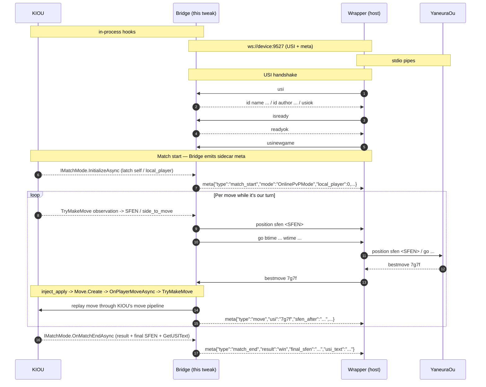

<h1 align="center">Kiou Engine Bridge</h1>

<p align="center">
  
</p>

<p align="center">
  <em>Bridge <strong>KIOU</strong> to a desktop USI shogi engine (YaneuraOu
  and friends) — observe the live board, ship the SFEN to the engine,
  replay the engine's <code>bestmove</code> back into the running match.<br/>
  Runs entirely client-side; the engine sits on a LAN box you already trust.</em>
</p>

<p align="center">
  
  
  
  
  
  
  
  
  
</p>

---

Kiou Engine Bridge is the in-app half of a two-piece system: the tweak
runs inside KIOU and exposes a tiny WebSocket sink on `0.0.0.0:9527`;
a host-side bridge (your machine running YaneuraOu or any other USI
engine) connects in, speaks the standard USI protocol, and receives
`position sfen ...` / `go ...` lines built from the live KIOU board.
When the engine replies with `bestmove <usi>`, the tweak feeds that
move back into KIOU's own `TryMakeMove` / `OnPlayerMoveAsync` paths so
the on-device match advances exactly as if you had played it yourself.

No proxy server, no cloud, no third-party service — one ~120 KB dylib
on the phone, one TCP socket to a LAN box, and the engine of your choice
on the other end.

### Observation + scoped injection

Kiou Engine Bridge is **read-mostly with a single narrow write path**.
The observation hooks (`Hook_LowLevelObserve`, `Hook_MatchModeObserve`,
`Hook_OnlineObserve`, `Hook_GameOrchestratorObserve`,
`Hook_GameStateStoreObserve`) only read — they latch live
`GameController` / `ShogiGameAdapter` / `OnlinePvPMode` pointers,
convert `Sunfish.Move` to USI, walk `PositionHistory` to extract SFEN.
No game-state field is mutated through these.

The injection layer (`Inject_Move`) calls into KIOU's own move-commit
methods as function pointers:

- `Sunfish.Move.Create` / `Move.CreateDrop` to assemble the
  packed-uint32 move,
- `ShogiGameAdapter.TryMakeMove(out Move)` /
  `GameController.TryMakeMove(Move)` to advance the headless engine,
- `IMatchMode.OnPlayerMoveAsync(Move, CancellationToken)` so the UI
  redraws and the server (Online) sees the move.

What the injection layer is **not** allowed to do:

- Touch il2cpp object fields directly. The shared header
  `il2cpp.h` is intentionally read-only; the `writeU8` / `writeI32`
  helpers that `KiouEditor` carries in its own `Internal.h` are
  deliberately **not** included here. Any future "tweak a board field"
  regression must opt in explicitly — they don't sneak in via the
  shared header.
- Replay anything that didn't come from the engine. Only frames the
  attached WebSocket client sends as `bestmove <usi>` (after a
  matching `go`) make it into the move pipeline.

Uninstalling the dylib returns KIOU to a fully vanilla state.

## What you get

Four actors, three wires. KIOU is the game itself; Bridge is this
tweak loaded into KIOU's process; Wrapper is the host-side process
that translates between WebSocket and a vanilla USI engine's stdio;
YaneuraOu (or any other USI engine) is the thinking part.

- **KIOU <-> Bridge** — in-process: il2cpp hook callbacks for the
  read side, function-pointer calls into `Move.Create` /
  `OnPlayerMoveAsync` / `TryMakeMove` for the inject side.
- **Bridge <-> Wrapper** — WebSocket text frames on
  `ws://<device>:9527`, USI lines + sidecar `meta{...}` lines.
- **Wrapper <-> YaneuraOu** — stdio pipes (the way YaneuraOu
  already expects to be driven).



Each `meta` frame is a single line prefixed with the literal
`meta` followed by a single JSON object, so the Wrapper can demux
it from real USI traffic without parsing JSON for every line.

## How it works


Two protocol streams share one TCP port:

| Stream | Direction | Wire | Purpose |
|---|---|---|---|
| **USI** | bidirectional | one USI command per text frame | carry the tweak-owned handshake, `position sfen ...`, `bestmove ...`, and end-of-game notifications |
| **meta** | tweak -> host | `meta{...json}\n` per frame | match lifecycle + per-move record for KIF assembly |

The USI state machine in `Sources/KiouEngineBridge/Usi_Engine.m`
currently owns this surface on the WebSocket link:

| Command | Direction | Status | Notes |
|---|---|---|---|
| `usi` | tweak -> peer | supported | sent on WS connect |
| `id name ...` / `id author ...` | peer -> tweak | observed | logged, not interpreted |
| `option ...` | peer -> tweak | observed | logged, not interpreted |
| `usiok` | peer -> tweak | supported | advances handshake to `isready` |
| `isready` | tweak -> peer | supported | sent after `usiok` |
| `readyok` | peer -> tweak | supported | advances to READY and triggers `usinewgame` |
| `usinewgame` | tweak -> peer | supported | sent once the peer reports ready |
| `position sfen <sfen>` | tweak -> peer | supported | emitted when observation says it is our turn |
| `info ...` | peer -> tweak | partially supported | `info string ...` is cached; other forms are logged and ignored |
| `bestmove <usi>` | peer -> tweak | supported | injected through KIOU's normal move pipeline |
| `gameover win|lose|draw` | tweak -> peer | supported | sent on match end when the result is known |
| `setoption ...` | either | not handled by the tweak | expected to live on the host peer / wrapper side |
| `go ...` | either | not handled by the tweak | current design leaves think-limit policy to the host peer / wrapper side |
| `stop` | peer -> tweak | not supported yet | currently ignored |
| `ponderhit` | peer -> tweak | not supported yet | current flow does not expose ponder mode |
| `quit` | peer -> tweak | not supported yet | current flow treats WS disconnect as session end |
| `position startpos moves ...` | either | not emitted | outbound path uses `position sfen ...` from KIOU's live board snapshot |
| `bestmove <move> ponder <move2>` | peer -> tweak | partial | only the primary bestmove token is consumed |

YaneuraOu-specific extensions such as `go depth`, `go nodes`,
`go movetime`, `go rtime`, `getoption`, `bench`, `moves`, `side`, and
other debug / benchmark commands are intentionally **out of scope** for
this tweak-level protocol surface. If you need them, implement them in
your host-side peer or wrapper and translate them there.

## Install

Pick the row that matches how your device is signed.

### Jailbroken (rootless — Dopamine / palera1n)

```sh
make package install THEOS_DEVICE_IP=<device-ip>
```

The dylib lands at `/var/jb/Library/MobileSubstrate/DynamicLibraries/KiouEngineBridge.dylib`
and is loaded by MobileSubstrate / ElleKit on next launch. Respring or
relaunch KIOU, then point your host bridge at `ws://<device-ip>:9527`.

### Non-JB (Sideloadly / TrollStore / AltStore / Apple Developer Program)

```sh
make binpatch
# -> packages/binpatch/KiouEngineBridge.dylib

shared/tools/build_patched_ipa.sh \
  --recipe kiouenginebridge \
  --framework UnityFramework \
  --dylib packages/binpatch/KiouEngineBridge.dylib \
  --input Kiou-1.0.1.ipa
# -> Kiou-1.0.1-patched.ipa
```

The patched IPA can be installed via TrollStore (direct), Sideloadly /
AltStore (sign with Apple ID), or the Apple Developer Program (sign
with a paid cert). Unlike runtime hook engines (Substrate, Dobby,
frida-gum), the static binary patch never writes to `__TEXT` at
runtime and therefore survives the iOS 18 Code Signing Monitor (CSM) —
the binpatch flavour covers iOS 15.0 – 18.x.

**Note:** the binpatch build omits the `meta` sidecar lines. KIF
assembly on the host bridge depends on `meta {…}` lines emitted by the
JB build's `GameStateStore` observation hooks. Non-JB users get USI
handshake + position/go/bestmove and can still play through YaneuraOu,
but no KIF record is assembled. See
`docs/plans/kiou_engine_bridge_binpatch.md` § 2 for the full build
matrix.

## Compatibility

| | |
|---|---|
| **KIOU app version** | `1.0.1` (`CFBundleVersion` 11) |
| **iOS (JB rootless build)** | 15.0 – 16.5, arm64, rootless |
| **iOS (non-JB binpatch build)** | 15.0 – 18.x, arm64 |
| **Engine wire** | standard USI protocol over WebSocket text frames |

All hooks are pinned to RVAs from this exact KIOU build's
`UnityFramework`. After a KIOU update the RVAs will drift and the
tweak will silently no-op (or crash on a method whose signature
changed). **Don't install this dylib against a KIOU version other
than the one above without re-deriving every RVA first.**

## Versioning

Kiou Engine Bridge uses **its own [SemVer](https://semver.org/)** numbering,
independent of the KIOU app's version. The two never share a digit.

| Field | What it means |
|---|---|
| `MAJOR` | Bumped on a breaking change to the wire protocol, distribution shape, or hook interface (e.g. dropping a build flavor). |
| `MINOR` | New observation hook, new injection path, new wire-protocol feature. |
| `PATCH` | Bug / crash / wiring fix with no user-visible behaviour change. |

The **target KIOU app version** is pinned separately in the
[Compatibility](#compatibility) table above and in `recipes/kiouenginebridge.py`'s
RVA table. When KIOU itself updates, every hook site is re-derived against
the new `UnityFramework`, and that re-port lands as a PATCH or MINOR —
never a MAJOR just because the host bumped.

Releases are tagged `vMAJOR.MINOR.PATCH` on the repo. The dylib also
embeds the short git commit hash (read at build time into
`KIOU_ENGINE_BRIDGE_COMMIT`) so the exact build behind a sideloaded copy
is always recoverable.

## Requirements

- [Theos](https://theos.dev/) with the standard iOS toolchain installed
  (`$THEOS` set). Kiou Engine Bridge is pure Objective-C — no Orion,
  no Swift runtime.
- iOS 15.0–16.5, arm64, rootless layout.
- For the jailed (sideload) path: a decrypted copy of the KIOU `.ipa`.
- A host-side bridge that speaks USI over WebSocket against
  `ws://<device-ip>:9527`. YaneuraOu wrapped in a tiny WS adapter is
  the reference setup.

## Layout

```
Sources/KiouEngineBridge/
  Internal.h                    # tweak-private declarations
  Tweak.m                       # constructor + UnityFramework dyld walk
  Hook_LowLevelObserve.m        # TryMakeMove / SFEN / USI extraction
  Hook_MatchModeObserve.m       # IMatchMode lifecycle (5 modes, 3 methods)
  Hook_OnlineObserve.m          # OnlinePvPMode snapshot / result observer
  Hook_GameOrchestratorObserve.m# match-end auto-rematch helper
  Hook_GameStateStoreObserve.m  # Set*PlayerInfo capture for meta_emit
  Hook_AfkSuppress.m            # pin GameOrchestrator.IsAfkEnabled = false
  Inject_Move.m                 # bestmove -> Move.Create / TryMakeMove path
  Usi_Engine.m                  # USI state machine (Phase 2)
  Server_WebSocket.m            # 0.0.0.0:9527 listener + recv loop
  Meta_Emitter.m                # sidecar JSON stream for KIF assembly
  BinpatchDispatcher.m          # binpatch-only: publishes hook dispatcher into __bss SLOT

Sources/Common/                 # IPA-Patch/Common submodule (logging, il2cpp, hookengine)
shared/                         # IPA-Patch/Shared submodule (binpatch tooling)
recipes/kiouenginebridge.py     # static-patch site table + cave payload builder
scripts/pre-commit              # recipe<->dump cross-check hook (install with `make hooks`)
```

### Developer hooks

```sh
make hooks
```

Registers `scripts/` as the git hooks path so `scripts/pre-commit` fires
before every commit. When a commit touches `recipes/*.py` or
`shared/tools/`, the hook runs `tools.verify_sites` to cross-check every
`_SITES` row against `assets/dump.cs.index.json`. If the dump index is
absent (not committed to the repo) the hook exits 0 and prints a heads-up —
it is a local-only gate, not a CI requirement.

## Where the logs go

The dylib writes its own diagnostic log into the KIOU sandbox:

```
<KIOU sandbox>/tmp/kiouenginebridge.log
```

— which translates to `/var/mobile/Containers/Data/Application/<UUID>/tmp/kiouenginebridge.log`
on a jailbroken device. Tail it over SSH to watch matches and the
USI handshake resolve in real time:

```sh
ssh root@<device-ip> 'tail -F /var/mobile/Containers/Data/Application/*/tmp/kiouenginebridge.log'
```

Each match produces `[MMODE]` lifecycle lines, `[WS]` connection
events, and `[USI]` engine-state transitions interleaved with the
move-injection results.

## Sibling tweaks

Kiou Engine Bridge shares its il2cpp helpers and logging plumbing with
two sister projects you can install side-by-side. All three can
coexist in the same KIOU process:

- [**Kiou Editor**](https://github.com/IPA-Patch/KiouEditor) — the
  client-side customization suite (item unlock, premium gating, engine
  tuning, voice unlock, etc).
- [**Kiou Kif Exporter**](https://github.com/IPA-Patch/KiouKifExporter) —
  saves every match as a standard KIF 2.0 file in the app sandbox,
  ready for Files.app / AirDrop / PiyoShogi.

Bridge and KifExporter use the same static-binpatch toolchain
(`shared/tools/patch_macho.py`) and can be applied to the same IPA —
their cave regions are partitioned
(`docs/plans/kiou_kif_exporter_binpatch.md` § 8). Stack both dylibs in
Sideloadly to ship a single patched IPA that does both jobs.

## Plan documents

- [`docs/plans/kiou_engine_bridge_binpatch.md`](docs/plans/kiou_engine_bridge_binpatch.md) —
  this project's static-binpatch migration plan.
- [`docs/plans/kiou_kif_exporter_binpatch.md`](docs/plans/kiou_kif_exporter_binpatch.md) —
  the sibling KifExporter recipe that pioneered the same approach.

## License

Released under the [MIT License](LICENSE) — see the `LICENSE` file for the
full text.

### Scope of use

Intended for **authorized penetration testing and personal research**. The
repository ships no proprietary KIOU assets and does not distribute the
IPA — sourcing a decrypted copy of KIOU for the sideload path is the
reader's responsibility. Online ranked play through this bridge can
affect your account's rating; the tweak does not gate that behavior,
so use against ranked matches only on accounts and in jurisdictions
where you have the authority to do so.
