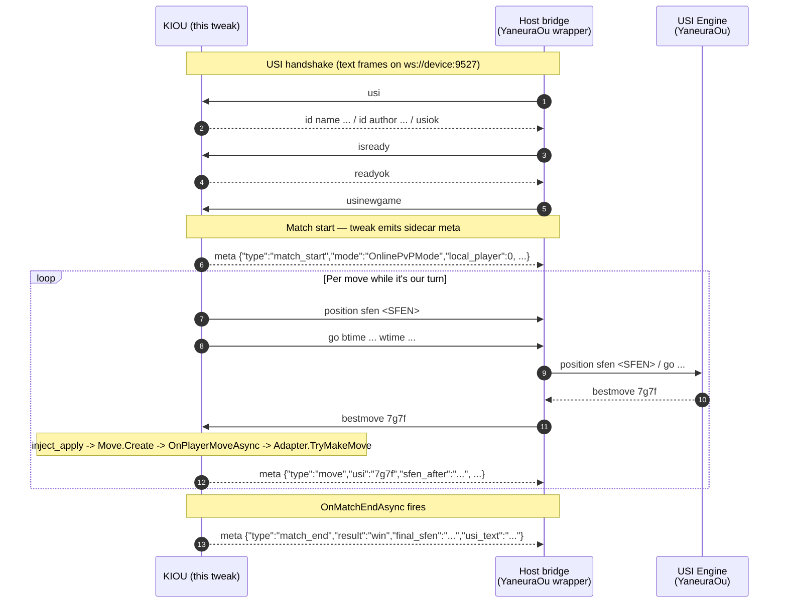
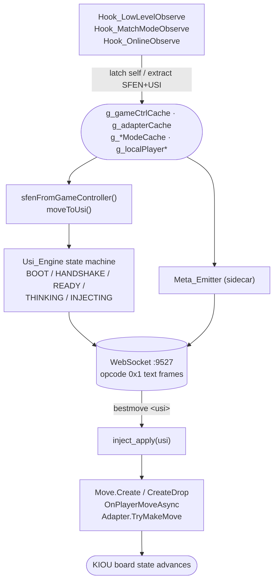

<h1 align="center">Kiou Engine Bridge</h1>

<p align="center">
  
</p>

<p align="center">
  <em>Bridge <strong>KIOU</strong> to a desktop USI shogi engine (YaneuraOu
  and friends) — observe the live board, ship the SFEN to the engine,
  replay the engine's <code>bestmove</code> back into the running match.<br/>
  Runs entirely client-side; the engine sits on a LAN box you already trust.</em>
</p>

<p align="center">
  
  
  
  
  
  
  
  
</p>

---

Kiou Engine Bridge is the in-app half of a two-piece system: the tweak
runs inside KIOU and exposes a tiny WebSocket sink on `0.0.0.0:9527`;
a host-side bridge (your machine running YaneuraOu or any other USI
engine) connects in, speaks the standard USI protocol, and receives
`position sfen ...` / `go ...` lines built from the live KIOU board.
When the engine replies with `bestmove <usi>`, the tweak feeds that
move back into KIOU's own `TryMakeMove` / `OnPlayerMoveAsync` paths so
the on-device match advances exactly as if you had played it yourself.

No proxy server, no cloud, no third-party service — one ~120 KB dylib
on the phone, one TCP socket to a LAN box, and the engine of your choice
on the other end.

### Observation + scoped injection

Kiou Engine Bridge is **read-mostly with a single narrow write path**.
The observation hooks (`Hook_LowLevelObserve`, `Hook_MatchModeObserve`,
`Hook_OnlineObserve`, `Hook_GameOrchestratorObserve`,
`Hook_GameStateStoreObserve`) only read — they latch live
`GameController` / `ShogiGameAdapter` / `OnlinePvPMode` pointers,
convert `Sunfish.Move` to USI, walk `PositionHistory` to extract SFEN.
No game-state field is mutated through these.

The injection layer (`Inject_Move`) calls into KIOU's own move-commit
methods as function pointers:

- `Sunfish.Move.Create` / `Move.CreateDrop` to assemble the
  packed-uint32 move,
- `ShogiGameAdapter.TryMakeMove(out Move)` /
  `GameController.TryMakeMove(Move)` to advance the headless engine,
- `IMatchMode.OnPlayerMoveAsync(Move, CancellationToken)` so the UI
  redraws and the server (Online) sees the move.

What the injection layer is **not** allowed to do:

- Touch il2cpp object fields directly. The shared header
  `kiou_il2cpp.h` is intentionally read-only; the `writeU8` / `writeI32`
  helpers that `KiouEditor` carries in its own `Internal.h` are
  deliberately **not** included here. Any future "tweak a board field"
  regression must opt in explicitly — they don't sneak in via the
  shared header.
- Replay anything that didn't come from the engine. Only frames the
  attached WebSocket client sends as `bestmove <usi>` (after a
  matching `go`) make it into the move pipeline.

Uninstalling the dylib returns KIOU to a fully vanilla state.

## What you get

When a match is live in KIOU and the host bridge is attached, two
streams share one WebSocket on `:9527` — the standard USI handshake +
think loop, and a sidecar `meta` channel that carries match-lifecycle
JSON the host can use to build a KIF on its end.



Each `meta` frame is a single line prefixed with `meta ` so the host
can demux it from real USI traffic without parsing JSON for every
line.

Each frame is a single line, prefixed with `meta ` so the host can
demux it from real USI traffic without parsing JSON for every line.

## How it works



Two protocol streams share one TCP port:

| Stream | Direction | Wire | Purpose |
|---|---|---|---|
| **USI** | bidirectional | one USI command per text frame | drive the engine, accept `bestmove` back |
| **meta** | tweak -> host | `meta {...json}\n` per frame | match lifecycle + per-move record for KIF assembly |

The USI state machine (`Usi_Engine.m`) walks the standard
`usi` -> `usiok` -> `isready` -> `readyok` -> `usinewgame` -> `position` ->
`go` -> `bestmove` cycle; on `bestmove` it hops onto the Unity main
thread and calls `inject_apply` to commit the move through KIOU's own
move pipeline.

## Install

Pick the row that matches how your device is signed.

### Jailbroken (rootless — Dopamine / palera1n)

```sh
make package install THEOS_DEVICE_IP=<device-ip>
```

The dylib lands at `/var/jb/Library/MobileSubstrate/DynamicLibraries/KiouEngineBridge.dylib`
and is loaded by MobileSubstrate / ElleKit on next launch. Respring or
relaunch KIOU, then point your host bridge at `ws://<device-ip>:9527`.

### Sideloadly / AltStore / Apple Developer Program

```sh
make jailed
# -> packages/jailed/KiouEngineBridge.dylib
```

`make jailed` rebuilds with Dobby statically linked and copies the
artifact into `packages/jailed/`. The target also runs `otool -L` and
the output must **not** mention `libsubstrate` or `libdobby`.

In Sideloadly:

1. Drop the decrypted KIOU `.ipa` in.
2. Under **Inject dylibs**, add `packages/jailed/KiouEngineBridge.dylib`.
3. Sign with your Apple ID / certificate and install.

The same dylib works with AltStore (drop the IPA in, add the dylib
under **Settings -> Advanced** before signing).

## Compatibility

| | |
|---|---|
| **KIOU app version** | `1.0.1` (`CFBundleVersion` 11) |
| **iOS** | 15.0 – 16.5, arm64, rootless |
| **Engine wire** | standard USI protocol over WebSocket text frames |

All hooks are pinned to RVAs from this exact KIOU build's
`UnityFramework`. After a KIOU update the RVAs will drift and the
tweak will silently no-op (or crash on a method whose signature
changed). **Don't install this dylib against a KIOU version other
than the one above without re-deriving every RVA first.**

## Requirements

- [Theos](https://theos.dev/) with the standard iOS toolchain installed
  (`$THEOS` set). Kiou Engine Bridge is pure Objective-C — no Orion,
  no Swift runtime.
- iOS 15.0–16.5, arm64, rootless layout.
- For the jailed (sideload) path: a decrypted copy of the KIOU `.ipa`.
- A host-side bridge that speaks USI over WebSocket against
  `ws://<device-ip>:9527`. YaneuraOu wrapped in a tiny WS adapter is
  the reference setup.

## Layout

```
Sources/KiouEngineBridge/
  Internal.h                    # tweak-private declarations
  Tweak.m                       # constructor + UnityFramework dyld walk
  Hook_LowLevelObserve.m        # TryMakeMove / SFEN / USI extraction
  Hook_MatchModeObserve.m       # IMatchMode lifecycle (5 modes, 3 methods)
  Hook_OnlineObserve.m          # OnlinePvPMode snapshot / result observer
  Hook_GameOrchestratorObserve.m# match-end auto-rematch helper
  Hook_GameStateStoreObserve.m  # Set*PlayerInfo capture for meta_emit
  Hook_AfkSuppress.m            # pin GameOrchestrator.IsAfkEnabled = false
  Inject_Move.m                 # bestmove -> Move.Create / TryMakeMove path
  Usi_Engine.m                  # USI state machine (Phase 2)
  Server_WebSocket.m            # 0.0.0.0:9527 listener + recv loop
  Meta_Emitter.m                # sidecar JSON stream for KIF assembly

vendor/dobby                    # symlink to KiouEditor/vendor/dobby/
../_shared/                     # kiou-shared submodule (logging, il2cpp, hookengine)
```

## Where the logs go

The dylib writes its own diagnostic log into the KIOU sandbox:

```
<KIOU sandbox>/tmp/kiouenginebridge.log
```

— which translates to `/var/mobile/Containers/Data/Application/<UUID>/tmp/kiouenginebridge.log`
on a jailbroken device. Tail it over SSH to watch matches and the
USI handshake resolve in real time:

```sh
ssh root@<device-ip> 'tail -F /var/mobile/Containers/Data/Application/*/tmp/kiouenginebridge.log'
```

Each match produces `[MMODE]` lifecycle lines, `[WS]` connection
events, and `[USI]` engine-state transitions interleaved with the
move-injection results.

## Sibling tweaks

Kiou Engine Bridge shares its il2cpp helpers and logging plumbing with
two sister projects you can install side-by-side. All three can
coexist in the same KIOU process:

- [**Kiou Editor**](https://github.com/IPA-Patch/KiouEditor) — the
  client-side customization suite (item unlock, premium gating, engine
  tuning, voice unlock, etc).
- [**Kiou Kif Exporter**](https://github.com/IPA-Patch/KiouKifExporter) —
  saves every match as a standard KIF 2.0 file in the app sandbox,
  ready for Files.app / AirDrop / PiyoShogi.

## License

Released under the [MIT License](LICENSE) — see the `LICENSE` file for the
full text.

### Scope of use

Intended for **authorized penetration testing and personal research**. The
repository ships no proprietary KIOU assets and does not distribute the
IPA — sourcing a decrypted copy of KIOU for the sideload path is the
reader's responsibility. Online ranked play through this bridge can
affect your account's rating; the tweak does not gate that behavior,
so use against ranked matches only on accounts and in jurisdictions
where you have the authority to do so.
