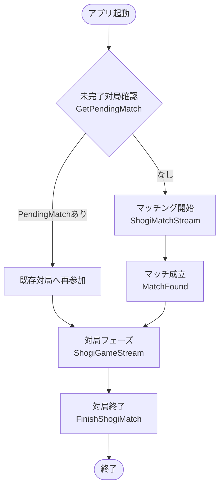
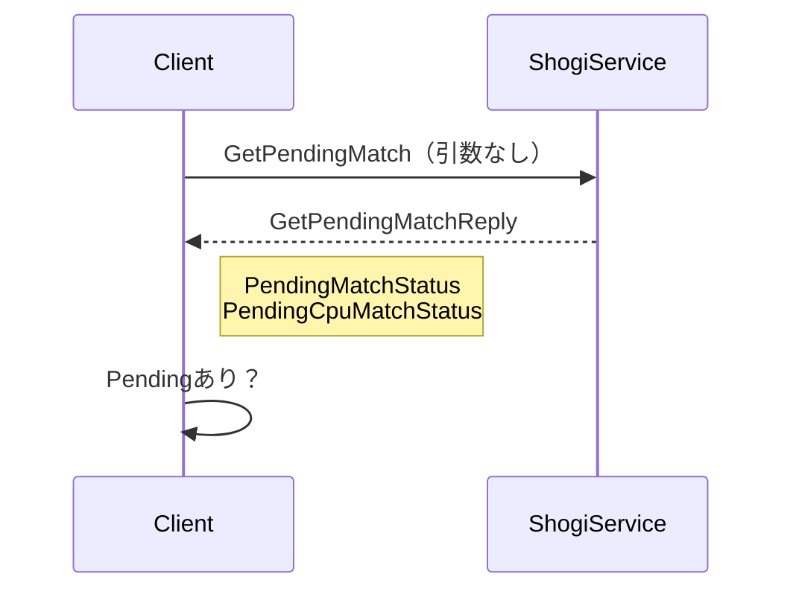
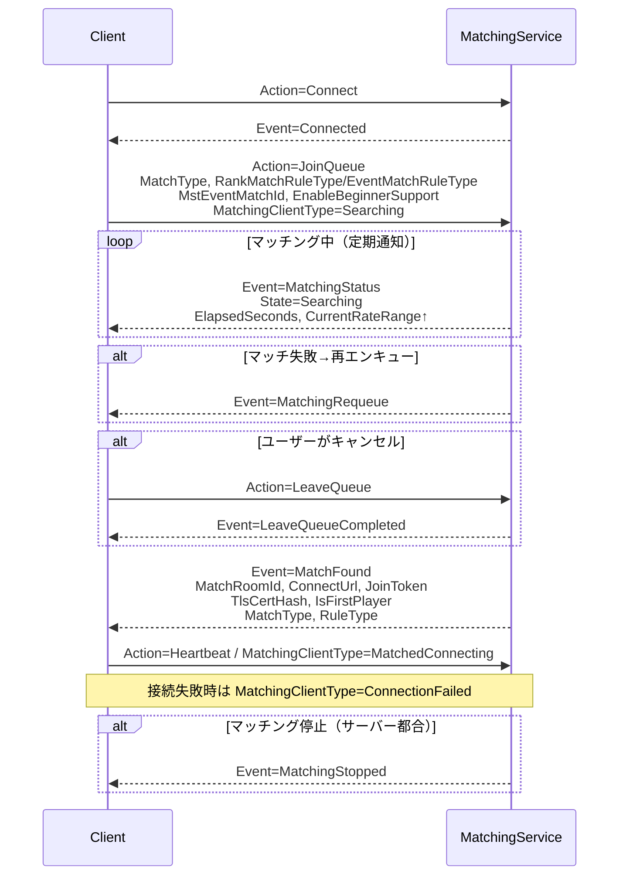
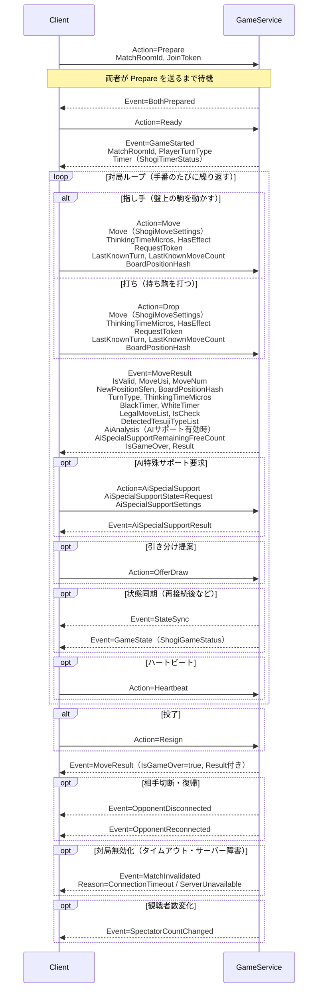
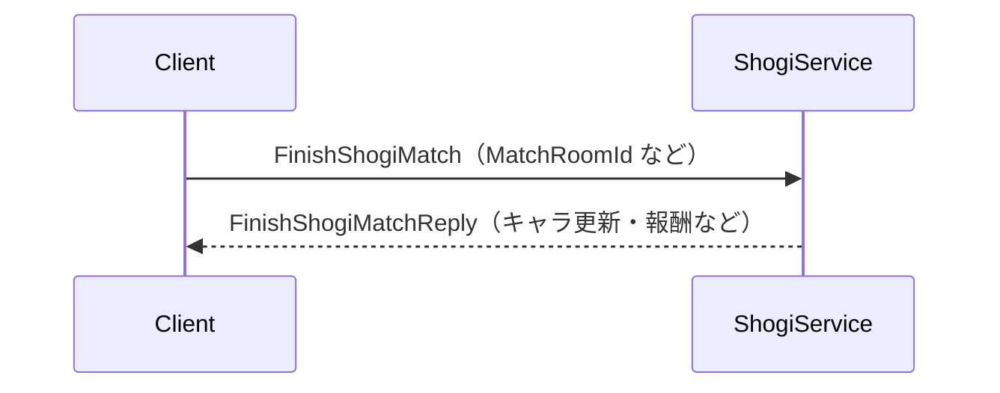
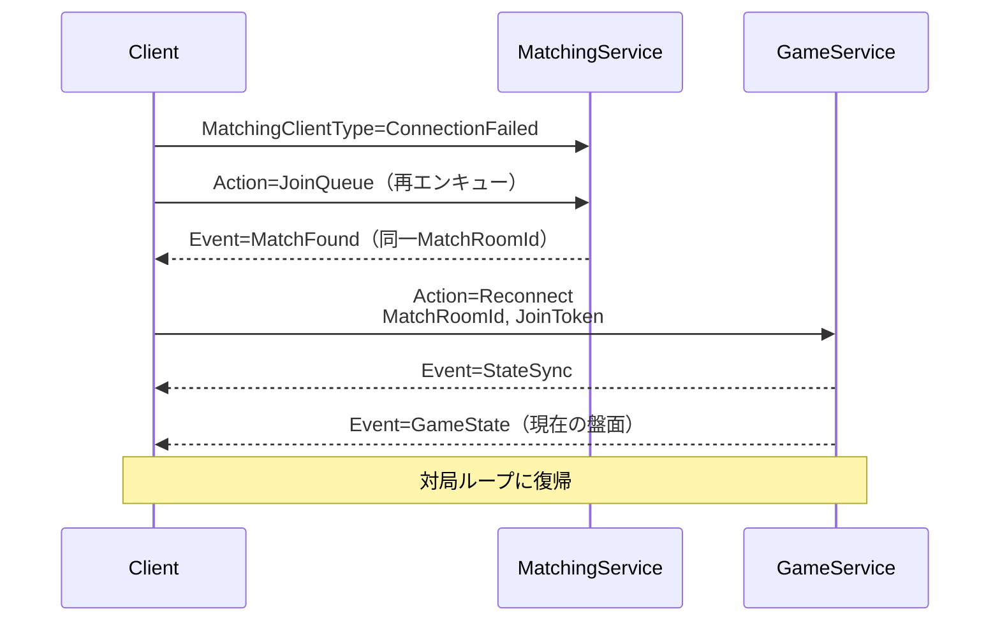
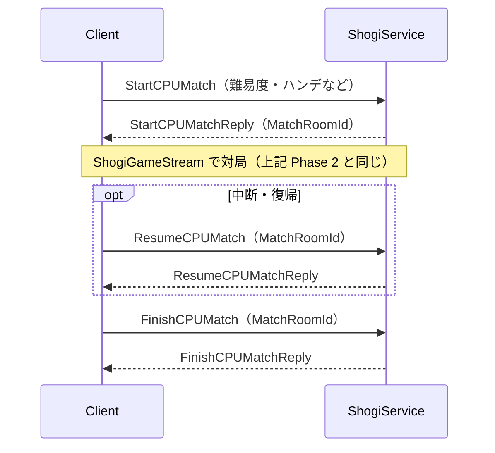

# 対局マッチメイキングフロー

## 全体フロー（概略）

---

## Phase 0：未完了対局チェック（単項 RPC）

---

## Phase 1：マッチング（双方向ストリーミング `ShogiMatchStream`）

### `MatchingStatus` のフィールド

| フィールド | 型 | 内容 |
|---|---|---|
| `State` | `ShogiMatchingState` | Idle / Searching / Matched / InGame |
| `QueueStartDate` | Timestamp | キュー開始時刻 |
| `ElapsedSeconds` | int | 経過秒数 |
| `CurrentRateRange` | int | 現在のマッチングレートレンジ（時間で拡大） |

### `MatchFound` のフィールド

| フィールド | 型 | 内容 |
|---|---|---|
| `MatchRoomId` | string | 対局ルームID |
| `ConnectUrl` | string | ゲームサーバーURL（TLS） |
| `JoinToken` | string | 入室トークン |
| `TlsCertHash` | string | TLS証明書ハッシュ |
| `IsFirstPlayer` | bool | 先手かどうか |
| `MatchType` | enum | RankMatch / EventMatch / LobbyMatch |
| `RankMatchRuleType` | enum | Beginner / Vip / Fischer / Bullet3Min |
| `EventMatchRuleType` | enum | Beginner / Vip / Short / Medium |

---

## Phase 2：対局（双方向ストリーミング `ShogiGameStream`、`ConnectUrl` へ TLS 接続）

### `ShogiGameStreamArgs`（C→S）の主要フィールド

| フィールド | 型 | 内容 |
|---|---|---|
| `MatchRoomId` | string | 対局ルームID |
| `JoinToken` | string | 入室トークン |
| `Move` | ShogiMoveSettings | 移動元・先・成り判定など |
| `ThinkingTimeMicros` | long | 考慮時間（マイクロ秒） |
| `HasEffect` | bool | エフェクト有無 |
| `RequestToken` | string | 冪等性トークン |
| `LastKnownTurn` | ShogiTurnType | 直前ターン（同期用） |
| `LastKnownMoveCount` | int | 直前手数（同期用） |
| `BoardPositionHash` | ulong | 盤面ハッシュ（同期用） |
| `GamePhaseType` | ShogiGamePhaseType | クライアント側の現在フェーズ |
| `IncludeSecondBest` | bool | 次善手も含むか |

### `MoveResult`（S→C）の主要フィールド

| フィールド | 型 | 内容 |
|---|---|---|
| `IsValid` | bool | 合法手か |
| `MoveUsi` | string | USI形式の指し手 |
| `MoveNum` | int | 手数 |
| `NewPositionSfen` | string | 指し手後のSFEN |
| `BoardPositionHash` | ulong | 盤面ハッシュ |
| `TurnType` | ShogiTurnType | 次の手番（Black/White） |
| `ThinkingTimeMicros` | long | 実際の考慮時間 |
| `BlackTimer` / `WhiteTimer` | ShogiPlayerTimerStatus | 両者の残り時間 |
| `LegalMoveList` | list | 次手の合法手一覧 |
| `IsCheck` | bool | 王手かどうか |
| `IsGameOver` | bool | 終局かどうか |
| `Result` | ShogiGameResultStatus | 勝敗・理由 |
| `DetectedTesujiTypeList` | list | 検出された手筋 |
| `AiAnalysis` | ShogiAIAnalysisStatus | AI分析結果 |
| `AiSpecialSupportUsed` | bool | AIサポート使用有無 |
| `AiSpecialSupportRemainingFreeCount` | int | 無料残回数 |

---

## Phase 3：対局終了（単項 RPC）

---

## 再接続フロー

---

## CPU対局フロー（単項 RPC 系）

---

## 終局理由一覧（`ShogiMatchResultReasonType`）

| 値 | 内容 |
|---|---|
| Resign | 投了 |
| Checkmate | 詰み |
| TimeOver | 時間切れ |
| NyugyokuDeclaration | 入玉宣言 |
| ThousandYearHand | 千日手 |
| PerpetualCheck | 連続王手の千日手 |
| MaxMovesDraw | 最大手数引き分け |
| Stalemate | ステールメイト |
| Illegal | 反則 |
| Disconnect | 切断 |
| ConnectionTimeout | 接続タイムアウト |
| BothDisconnected | 両者切断 |
| ServerUnavailable | サーバー障害 |
| CpuMatchAbandoned | CPU対局放棄 |
