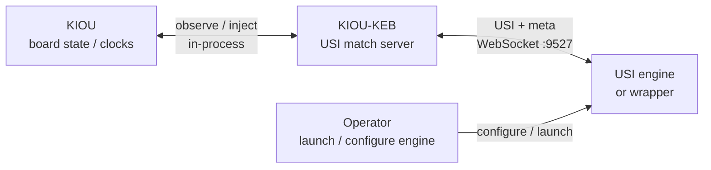
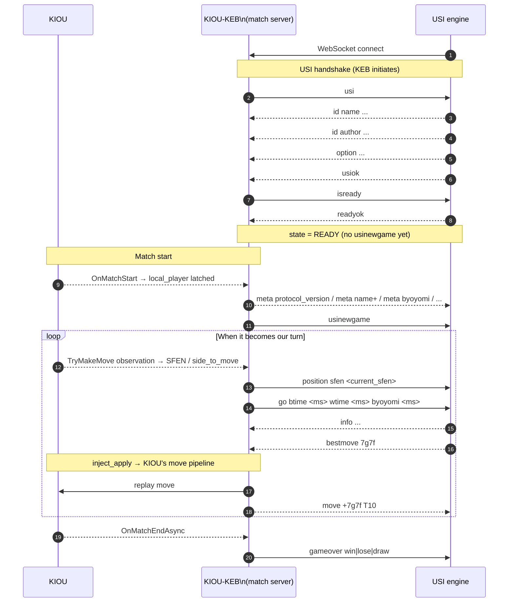
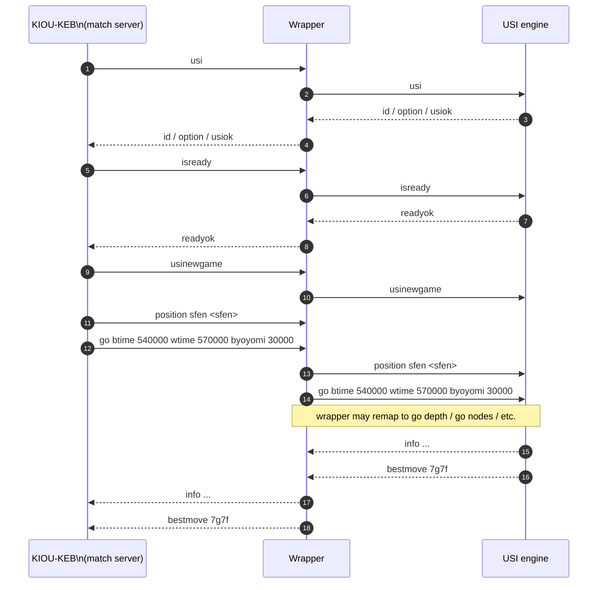

# KIOU-KEB USI compatibility

This document explains the KIOU-KEB role in the USI protocol and which
commands are supported. The authoritative wire contract is `docs/bridge_protocol.md`;
if this file and that document disagree, `bridge_protocol.md` wins.

Primary implementation sources:

- `Sources/KiouEngineBridge/Usi_Engine.m`
- `Sources/KiouEngineBridge/Server_WebSocket.m`
- `Sources/KiouEngineBridge/Meta_Emitter.m`

## Role model

KEB is a **USI match server** embedded inside the KIOU process — similar
in role to Floodgate or shogi-server. KIOU is the authoritative source
of board state and clocks. An engine (or a wrapper in front of one)
connects to KEB over WebSocket and receives `position` + `go` each turn,
exactly as it would from any other USI match server.



The engine does not need to know or care that there is a KIOU process
behind KEB. It connects, plays, and receives `bestmove` feedback in
standard USI.

### Why KEB cannot pre-negotiate time control

In a typical USI GUI the time control is known before the match starts
and can be communicated via `setoption`. KEB has no such opportunity:
match conditions are set by KIOU and only become available to KEB
after `OnMatchStart` fires. The engine therefore learns the time budget
from the first `go btime/wtime/byoyomi` line of the first turn, not
from a pre-match declaration. A wrapper that needs to translate this
into engine-specific search limits should observe the `go` line and
remap it accordingly.

## CSA protocol correspondence

KEB's design is conceptually modelled on the CSA server protocol
(v1.2.1, `https://www.computer-shogi.org/protocol/tcp_ip_server_121.html`).
The table below maps each CSA concept to the KEB equivalent and notes
where reproduction is impossible given KIOU's constraints.

### Session management

| CSA concept | CSA line | KEB equivalent | Status |
|---|---|---|---|
| Connect | TCP to port 4081 | WebSocket to port 9527 | ✅ different transport, same idea |
| Login | `LOGIN name pass` | WS upgrade (no auth) | ⚠️ omitted — no auth in KEB |
| Logout | `LOGOUT` / `LOGOUT:completed` | `quit` / WS disconnect | ✅ partial |

### Match negotiation

CSA servers send a `BEGIN Game_Summary ... END Game_Summary` block
before the match starts so engines can inspect time control and initial
position before agreeing. KEB has no equivalent pre-match block because
match conditions are not known until `OnMatchStart` fires inside KIOU.
Instead, the same information is delivered in two ways:

- **`meta` lines** (JB build only) — flat sequence of extended USI
  lines with player names, time control settings, mode, and initial
  position type. Arrive before `usinewgame`, which signals the end of
  the metadata.
- **`go` line** — carries the live `btime`/`wtime`/`byoyomi` values
  each turn.

| CSA field | CSA line | KEB equivalent | Status |
|---|---|---|---|
| Protocol version | `Protocol_Version:1.2` | `meta ProtocolVersion 1.0` | ✅ JB build |
| Game ID | `Game_ID:...` | `meta GameId ...` | ✅ JB build |
| Black player name | `Name+:YaneuraOu` | `meta Name+ ...` | ✅ JB build |
| White player name | `Name-:Kristallweizen` | `meta Name- ...` | ✅ JB build |
| Your seat | `Your_Turn:+` | `meta YourTurn b\|w\|-` | ✅ JB build |
| First to move | `To_Move:+` | SFEN side-to-move in first `position` | ✅ |
| Max moves | `Max_Moves:256` | — | ⛔ KIOU limit not exposed |
| Rematch on draw | `Rematch_On_Draw:NO` | — | ⛔ omitted |
| Engine agree/reject | `AGREE` / `REJECT` | — | ⛔ omitted — engine just connects and waits |
| Match start signal | `START:<GameID>` | `usinewgame` | ✅ |

### Time control

CSA's `BEGIN Time ... END Time` block can express a rich variety of
clocks. KEB delivers the same information via `go` parameters each turn,
derived from `MatchConfig.TimeControlConfig` and the live snapshot cache.

| CSA field | CSA line | KEB equivalent | Status |
|---|---|---|---|
| Time unit | `Time_Unit:1sec` | `meta TimeUnit 1sec` + implicit ms in `go` | ✅ JB build |
| Total (main) time | `Total_Time:600` | `meta TotalTime 600` + `btime`/`wtime` in `go` | ✅ JB build / when snapshot available |
| Byoyomi | `Byoyomi:30` | `meta Byoyomi 30` + `byoyomi` in `go` | ✅ |
| Increment | `Increment:10` | `meta Increment 10` + `binc`/`winc` in `go` | ✅ |
| Delay | `Delay:5` | — | ⛔ not exposed by KIOU |
| Min time per move | `Least_Time_Per_Move:1` | — | ⛔ not exposed by KIOU |
| Time roundup | `Time_Roundup:YES` | — | ⛔ not exposed by KIOU |
| Unlimited time | (all fields omitted) | `go movetime 30000` (fallback) | ⚠️ treated as movetime fallback |

### Per-turn exchange

This is the core of the CSA protocol: server notifies each engine of the
opponent's move, engine replies with its own move.

| CSA concept | CSA direction / line | KEB equivalent | Status |
|---|---|---|---|
| Position after opponent's move | `+7776FU,T10` (incremental) | `position sfen ...` (full snapshot) | ✅ different encoding |
| Move notification to peer | `+7776FU,T10` | `move +7g7f T10` | ✅ JB build |
| Remaining / consumed time per turn | `,T10` suffix on move line | `btime` / `wtime` in `go` | ✅ remaining (not consumed) |
| Engine submits move | `+7776FU` | `bestmove 7g7f` | ✅ |
| Engine resigns | `%TORYO` | `bestmove resign` | ✅ |
| Engine claims win (nyugyoku) | `%KACHI` | `bestmove win` | ✅ |
| Engine requests abort | `%CHUDAN` | — | ⛔ not supported |
| Keepalive / heartbeat | LF (≥30 s interval) | WS Ping/Pong frames | ✅ handled by transport |

### Match result

| CSA result | CSA lines | KEB equivalent | Status |
|---|---|---|---|
| Resign | `#RESIGN` + `#WIN` / `#LOSE` | `gameover win` / `gameover lose` | ✅ |
| Time up | `#TIME_UP` + `#WIN` / `#LOSE` | `gameover win` / `gameover lose` | ⚠️ result only, no TIME_UP signal |
| Illegal move | `#ILLEGAL_MOVE` + `#WIN` / `#LOSE` | `gameover win` / `gameover lose` | ⚠️ result only; KIOU handles detection |
| Sennichite (draw) | `#SENNICHITE` + `#DRAW` | `gameover draw` | ✅ |
| Oute-sennichite | `#OUTE_SENNICHITE` + `#WIN` / `#LOSE` | `gameover win` / `gameover lose` | ⚠️ result only |
| Nyugyoku win | `#JISHOGI` + `#WIN` / `#LOSE` | `gameover win` / `gameover lose` | ⚠️ result only |
| Max moves reached | `#MAX_MOVES` + `#CENSORED` | `gameover draw` (KIOU-dependent) | ⚠️ result only |
| Server abort | `#CHUDAN` | — | ⛔ not surfaced |
| Unknown / open-seat | — | (gameover suppressed) | ✅ |

## Standard USI flow



## Wrapper-mediated deployment (optional)

A wrapper sits between KEB and the raw engine process. From KEB's
perspective, the wrapper is just the peer — the protocol is identical.
Typical wrapper responsibilities are engine spawning, `setoption`
injection, and `go` policy translation.



## Supported USI surface

Implemented in `Sources/KiouEngineBridge/Usi_Engine.m`.

### KEB → engine (outbound)

| Command | Status | Notes |
|---|---|---|
| `usi` | ✅ supported | Sent on WS connect. |
| `isready` | ✅ supported | Sent on inbound `usiok`. |
| `usinewgame` | ✅ supported | Sent once per match start (not per WS session). |
| `position sfen <sfen>` | ✅ supported | Emitted when KIOU observation says it is our turn. |
| `go btime <ms> wtime <ms> [byoyomi <ms>] [binc <ms>] [winc <ms>]` | ✅ supported | Emitted immediately after `position`, when authoritative clocks are available (Online / CPUStream). |
| `go movetime 30000` | ✅ supported | Fallback when authoritative clocks are not available (VsAI / Local modes, or first turn before snapshot arrives). |
| `gameover win\|lose\|draw` | ✅ supported | Sent on match end when the result is known. Suppressed for open-seat modes. |
| `stop` | 🔜 reserved | Not yet emitted. Planned for forced abort (e.g. operator resign mid-think). |
| `quit` | 🔜 reserved | Not yet emitted. Planned for clean session teardown. |

### engine → KEB (inbound)

| Command | Status | Notes |
|---|---|---|
| `id name ...` / `id author ...` | ✅ observed | Logged; not interpreted. |
| `option ...` | ✅ observed | Logged; not interpreted. |
| `usiok` | ✅ supported | Advances handshake; triggers `isready`. |
| `readyok` | ✅ supported | State → READY; triggers post-readyok kick if already our turn. Does NOT send `usinewgame`. |
| `info string ...` | ✅ partial | Value cached for debugging. |
| `info` (other forms) | ✅ partial | Logged; otherwise ignored. |
| `bestmove <usi>` | ✅ supported | Injected through KIOU's normal move pipeline. |
| `bestmove resign` / `(none)` / `win` | ✅ supported | No injection; state → READY. |
| `bestmove <usi> ponder <usi2>` | ✅ partial | Primary move injected; ponder token discarded. |
| `stop` | ✅ supported | If state is THINKING: logged, KEB waits for `bestmove` as normal. Otherwise ignored. |
| `quit` | ✅ supported | KEB closes WS and resets to BOOT. |
| `setoption ...` | ❌ not handled | Logged and dropped. Configure engine options in the wrapper. |
| `ponderhit` | ❌ not supported | No ponder mode exposed. |
| anything else | — | Logged at `[USI] ignored inbound:`; dropped. |

## `go` command detail

KEB emits `go` immediately after each `position sfen ...`, in the same
turn decision that triggered the `position` line.

**Clock-aware form** (Online and CPUStream modes, once a snapshot has arrived):

```
go btime <ms> wtime <ms> [byoyomi <ms>] [binc <ms>] [winc <ms>]
```

- `btime` / `wtime` come from the most recent `UpdateAuthoritativeSnapshot`
  call (`g_latestBlackTimeSec` / `g_latestWhiteTimeSec`, converted to ms).
- `byoyomi` / `binc` / `winc` come from `MatchConfig.TimeControlConfig`
  (`byoyomi_seconds` / `increment_seconds`). Parameters whose value is
  zero are omitted.

**Fallback form** (VsAI / LocalPvP / RecordReplay, or before the first
snapshot lands in Online):

```
go movetime 30000
```

The movetime value is 30 000 ms and is not yet runtime-configurable.

## Scope boundary

YaneuraOu-specific extensions (`go depth`, `go nodes`, `go rtime`,
`getoption`, `bench`, `moves`, `side`, etc.) and standard commands not
listed above (`debug`, `register`, `ponderhit`) are intentionally out of
scope for the KEB-level protocol surface.

If you need those, implement them in the wrapper layer and translate
to/from the `go btime/wtime/byoyomi` form that KEB emits.

## Related documents

- `docs/bridge_protocol.md` — authoritative wire contract and full example
  sessions.
- `README.md` — project overview and install/build notes.
- CSA server protocol v1.2.1 — `https://www.computer-shogi.org/protocol/tcp_ip_server_121.html`
